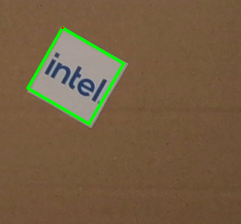
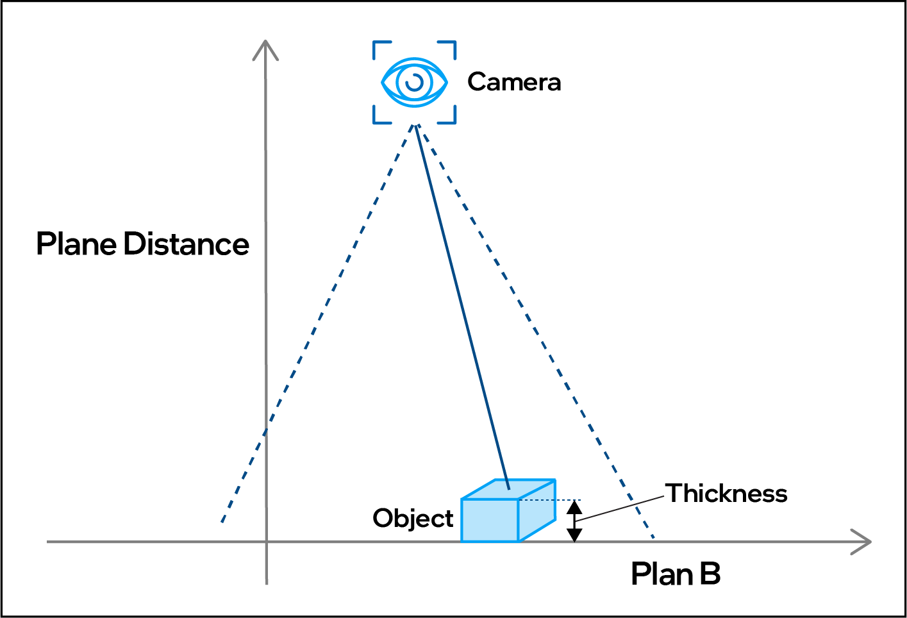
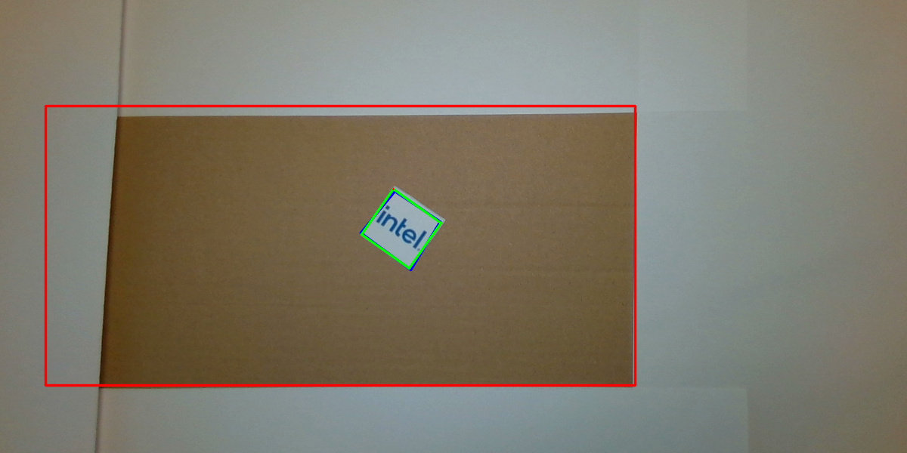

.. _2.5d_vision:

2.5D Vision
=============

2.5D Object Detector
^^^^^^^^^^^^^^^^^^^^
This approach uses a standard camera RGB steam together with the camera calibration.
With Computer Vision methods, the camera stream is scanned for given objects (by sample image).
A detection is in the form of a 2D bounding box with an additional angle defining the rotation of the object.

.. note:: 

    As this detection is purely vision based, the objects need to provide a certain level of contrast and unique optical features
    to be able to detect them and determine their position and orientation.
    Unicolor and/or symmetric objects will not be detectable with this component.

The primary output of this ``rotated_object_detection`` node is a :ref:`RVC Vision Messages<rvc_vision_messages>` `RotateBBList` containing the object detected and their respective rotated bounding boxes.

Pose Projection
^^^^^^^^^^^^^^^

Additionally, this component is capable of projecting the finding in the flat RGB input image into a 3D object pose.
Therefor the algorithm projects the object found in the 2D image onto a plane at the given distance and assumes that the object from the image is located on this plane.

The above illustration shows the setup and how the camera, the plana and the object relate to each other.

The output of this projection is a :ref:`API messages<rvc_api_messages>` `PoseStampedList` with the 6 dimentional poses of the objects detected.
This will be the input for the :ref:`Control<rvc_control>` components to define the actions and drive the robots.

Annotated image
^^^^^^^^^^^^^^^

The ``rotated_object_detection`` node can produce an annotated image as output. This is useful to visually inspect the detections.

Region of interest
""""""""""""""""""
The red rectangle marks the region of interest. The object detection only fousses on this region.

.. note:: 

    It is good practice to reduce the region of interest to the minimum area. Bigger areas are causing a higher amount of computation.
    Additionally, irrelevant high-contrast areas are injecting `noise` to the object detection, which might cause inaccurate or no detections.

Detections
""""""""""
The raw detection of an object is shown as a blue quadrilateral.
The processed and rectified oriented bounding box is overlayed in green. 

Configuration
^^^^^^^^^^^^^
The ``rotated_object_detection`` node is configurable both at launch time and - for some parameters - also at runtime.

Inputs
""""""
These parameters define the camera topics the node subscribes to.

::

    cam_prefix: "/camera/color"
    cam_image_suffix: "image_raw"
    cam_info_suffix: "camera_info"

ROI
"""
The number of pixel to crop from the input image.
These parameters could me modified during runtime.

::

    roi.crop_bottom: 0
    roi.crop_left: 0
    roi.crop_right: 0
    roi.crop_top: 0

Detector & Matcher
""""""""""""""""""
These parameters configure the optical feature detector and the matching process.
Please see `OpenCV documentation <https://docs.opencv.org/4.5.0/db/d95/classcv_1_1ORB.html#aeff0cbe668659b7ca14bb85ff1c4073b>`_ for details.

::

    orb.nfeatures: 500
    orb.nlevels: 8
    orb.edge_threshold: 5
    orb.patch_size: 16

The matcher condiders the following parameters:

::

    orb.min_matches: 20             # Minimum number of matches for detection
    orb.matches_limit: 20           # Number of matches limit for homography calculation
    orb.min_inliers: 10             # Minimum number of inliers for homography calculation
    orb.min_inliers_factor: 0.33    # Minimum factor of inliers vs all matches for homography calculation

Objects
"""""""
The objects to detect are confugured with the following structure.
::

    objects: ['object_1']             # list of object names for detection
    # the second level must match the entries from the objects list, here 'object_1'
    object.object_1.image_path: /path/to/reference/image.png 
    object.robot.nfeatures: 100       # maximum number of features to extract
    object.robot.thickness: 0.1       # object thickness / size parallel to optical axis

.. note:: 

    The reference image is ideally taken in the same setup as later used for detection.
    Identical lighting conditions are very crucial for the detection quality.
    Reflections, gloss etc.should be avoided both on the reference images and the ones from the camera.

    The reference image should be roughly the same size (between 50 and 200%) as the object to detect has in the images from the camera.

Projection
""""""""""
Enable / disable projection and define distance to projection plane (in meters)

::

    project: True
    projection_distance: 0.5

Other
"""""
Enable / disable creation of annotated image

::

    annotate: True

Launching 
^^^^^^^^^
The ``rvc_rotated_object_detection`` component provides two exemplary launch files, the first only starting the ``rotated_object_detection`` node.

.. code-block:: bash

    ros2 launch rvc_rotated_object_detection rotated_object_detection.launch.py

The second one also starts a Intel Realsense Camera node and a transformation publisher declaring the positioning of the camera relative to the world.

.. code-block:: bash

    ros2 launch rvc_rotated_object_detection realsense_rot_obj_detection.launch.py

These two exemplary launch files could also be used as basis to derive own uses-cases from it.
