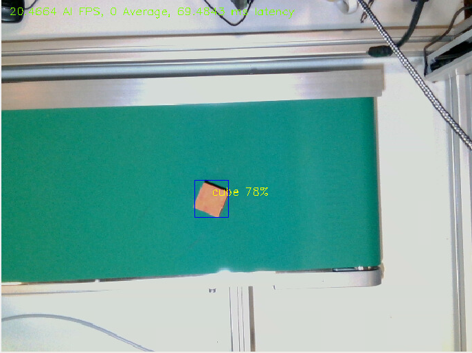

.. _object_detection:

Object Detection
^^^^^^^^^^^^^^^^

This component implements a plugin framework to host different
AI/computer vision plugins following the plugin_lib implementation.
Plugins have to follow rvc_ai_interface APIs.

One exemplary plugin implementing yolo v5/v6 and v8 is shown as
reference. 

In the following image, the results published on the topic ``<namespace>/inference_detection_image``

   Yolo inference with annotations

The object detection framework will deliver the (oriented) bounding box and the class identifier to 
the next stage of the vision pipeline, the pose detector via the custom message ``RotateBBList`` as 
described in :ref:`RVC Vision Messages<rvc_vision_messages>`.

 
The rvc_object_detection_engine will load the yaml specified
plugin from storage and run the plugin API:

The neural network models are loaded from a package specified as ``rvc_use_case_binaries`` as described below.

The engine accept following parameters: 

- publish_inference_images: enable/disable publishing annotated detection RGB stream
- model_name: specify filename of the DNN model to load
- class_name_array: String associated to the class ID of all objects, ascending ordered 
- plugin_name:  
- rvc_use_case_binaries: package name providing the needed binaries

Extracted from delivered example yaml config file ``rvc_object_detection_engine/config/parameters.yaml``

::

    plugin_name: "RVC_AI::OIInference"
    publish_yolo_images: true
    model_name: "yolo_nano"
    class_name_array: [ 'bolt', 'gear', 'nut', 'cube' ]
    rvc_use_case_binaries: "rvc_use_case_binaries"

Reference Yolo plugin
~~~~~~~~~~~~~~~~~~~~~

yolo specific parameters:

-  model_format: either ``onnx`` for onnx model, otherwise openvino native model
-  model_version: either ``8`` for yolo V8, otherwise v5/v6
-  rvc_us_case_binaries: path to the ai models (must contain directory ``/ai/models/``)
-  inference_device: Currently ``CPU`` or ``GPU``
-  resX: camera RGB image resolution X: Note: Must match the camera
   publisher image resolution!!
-  resY: camera RGB image resolution Y: Note: Must match the camera
   pubisher image resolution!!
-  confidence_threshold: float between 0 and 1, any detections below are excluded
-  nms_threshold: Non maxima suppression threshold parameter

Extracted from delivered example yaml config file ``rvc_object_detection_engine/config/parameters.yaml``

::

    inference_device: "CPU"
    model_format: "OpenVINO"
    model_version: 5
    rvc_use_case_binaries: "rvc_use_case_binaries"
    resX: 640
    resY: 480
    confidence_threshold: 0.7
    nms_threshold: 0.5
